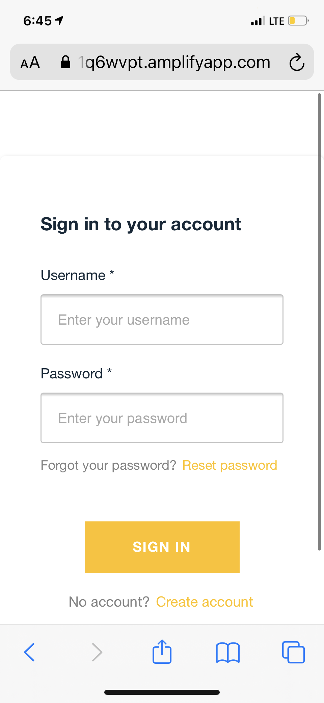
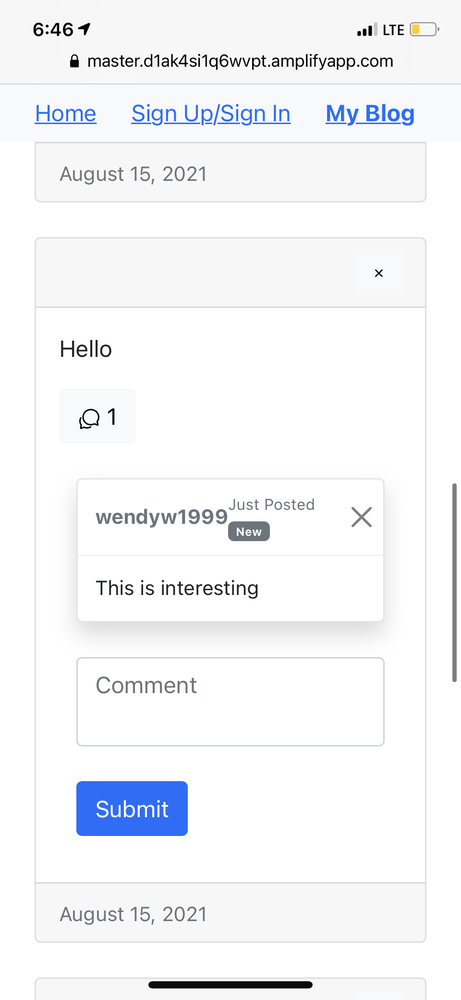

# Personal Blog Web Application

The website is available at:

https://master.d1ak4si1q6wvpt.amplifyapp.com

This Blog web app is designed for small groups to write personal blogs, read other's blogs and make comments to blogs. 
The web is mainly consisted of two main screens: home and personal blog. Home is where all the blog feed exists. Personal blog is consisted of only the blogs of signed-in user. 

# Feature 1: personal blog (enabled by AWS Cognito)
User can sign up or sign in with username and password. Once signed in, user can access his/her past blogs and write new blogs. The blogs are sorted according to time. 

    

                                                       
                                                       
# Feature 2: Filter Blog Feed by username
User can filter the feed by username to narrow down all the blog posts. 

# Feature 3: Make Comment

